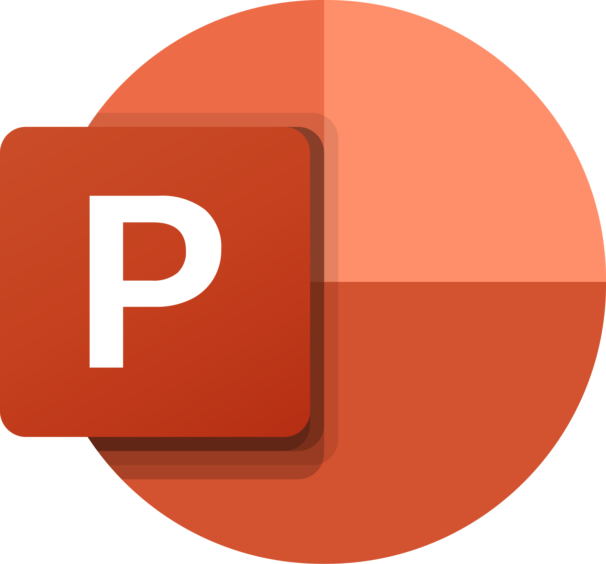

<h1 align="center"> Fireline </h1>
<p align="center">
  
</p>


---

<p align="center">
  
  
  
  
</p>


 ---

## 📌 Table of contents
- [About the Project](#about)
- [Documentation](#docs)
- [Installation & Setup](#install)
- [Tech Stack](#technologies)
- [Contributors](#team)

---

## 🔍 Description <a name="about"></a>
#

---

## 📃 Documentation and  Presentation   <a name="docs"></a>
- 📜 [Documentation](#)
- 🎤 [Presentation](#)

---

## 🚀 Installation  and  Setup <a name="install"></a> 

1️⃣ **Clone the Project Repository:**
```sh
 git clone https://github.com/codingburgas/9th-grade-html-project-fireline
```
2️⃣ Navigate to the Project Folder and click on "index.html"

## 💻Tech Stack <a name="technologies"></a>

###  Tools:
<p>
  
  
</p>

### Languages:
<p>
       
  
  
  
  
</p>

### Comunication: 


### Documentation: 
<p>
  
  
</p>


---
 ## 👥 Team <a name="team"></a>

| Name | Role | Grade |
| :---:   | :---: | :---: |
|  <h3><a href = "https://github.com/RFHristova23">Roberta Hristova</a></h3> | Scrum Trainer | 9B |
| <h3><a href = "https://github.com/DVMoldovanov23"> Daniil Moldovanov </a></h3>| Frontend Developer | 9V |
| <h3><a href = "https://github.com/KSTurmanov"> Konstantin Turmanov</a></h3> |  Backend Developer  | 9A |
| <h3><a href = "https://github.com/AODorosh23"> Amelia Dorosh</a></h3> | Designer | 9G |

---
